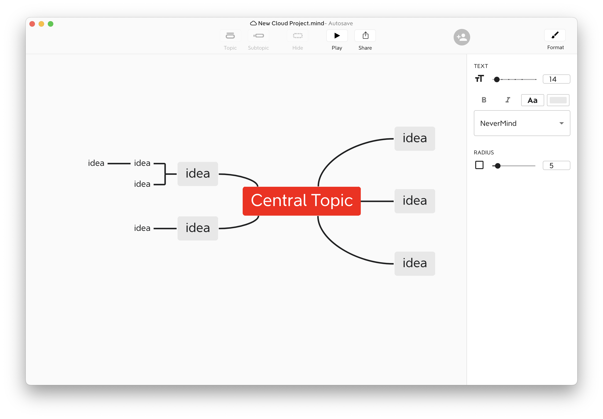

# 1Mind



# Instrukcja:
## Struktura
```
electron-react-typescript-base-proj/
| - dist/               //- Generated by Webpack automatically
| - node_modules/
| - out/                //- Generated by build script automatically
| - public/             //- Global static assets
| | - index.html
| | - style.css
| - src/
| | - main/             //- Backend modules for the Electron app
| | | - main.ts         //- Entry point of 'electron-main'
| | - models/
| | - renderer/         //- Frontend React components for the Electron app
| | | - renderer.tsx    //- Entry point of 'electron-renderer'
| | - utils/            //- Common utilities
| - test/               //- Unit tests
| - .eslintrc           //- ESLint config
| - .gitignore
| - package-lock.json
| - package.json
| - tsconfig.json       //- TypeScript config
| - tslint.json         //- TSLint config
| - webpack.config.js   //- Webpack config
```

## Setup:
```sh
npm install
```

## Naprawa:
```sh
npm clean-install
```
lub
```sh
rm -r ./node_modules
rm package-lock.json
npm install
```

## Uruchamianie:
Odpalanie serwera (React):
```sh
npm run dev
```

Odpalanie aplikacji (Electron) - w nowym oknie terminala
```sh
npm start
```
React automatycznie wykrywa zmiany w plikach, więc nic z nim nie trzeba robić. 
Żeby zobaczyć zmiany trzeba odświeyć Electrona w aplikacji (view/reload)

## Deugowanie:
- Błędy z typescripta - terminal gdzie działa server react
- Błędy z Reacta / Electrona - konsola w `view/Toggle Developer Tools` w aplikacji

## Budowanie
macOS
```sh
npm run build:mac
```

Windows:
```sh
npm run build:win
```

Linux:
```sh
npm run build:linux
```

## Dodatkowe info co do budowania
_** `asar` archiving is disabled by default in Windows build as it can cause 
errors while running the installed Electron app based on pervious experiences, 
whereas the macOS build with `asar` enabled works just fine. You can turn it 
back on by removing line 23 (`"asar": false`) in `package.json`. **_

### Extra options
The build scripts are pre-configured to build 64 bit installers since 64 bit 
should be the standard for a modern applications. 32 bit builds are still 
possible by changing the build scripts in `package.json` as below:
```json
// from
"scripts": {
    ...
    "build:win": "electron-builder build --win --x64",
    "build:mac": "electron-builder build --mac --x64"
},

// to
"scripts": {
    ...
    "build:win": "electron-builder build --win --ia32",
    // Works only on macOS version < 10.15
    "build:mac": "electron-builder build --mac --ia32"
},
```

Builds for Linux, armv71, and arm64 can also be configured by modifying the 
build scripts in `package.json`, but those aren't tested yet. For details, 
please refer to [documents of `electron-builder`](https://www.electron.build/cli).

## Known issues

- `dmg` build action on `macOS Catalina (10.15)` fails due to Apple ditches 
  support for 32-bit apps from `10.15` onwards (Don't worry, you are still 
  building 64-bit apps, just some dependencies of the builder are still 32-bit).
  Further details retailed to this issue can be found 
  [here](https://github.com/electron-userland/electron-builder/issues/3990).  
  Application installer built on `macOS` is now set to build `pkg` file 
  instead of `dmg` as a workaround in the current version. The issue can be 
  fixed by applying a major version upgrade of `electron-builder` to `21.2.0+` 
  but it hasn't been tested on this boilerplate yet. This issue is planned to 
  be addressed alongside with major version upgrades on other dependencies.
